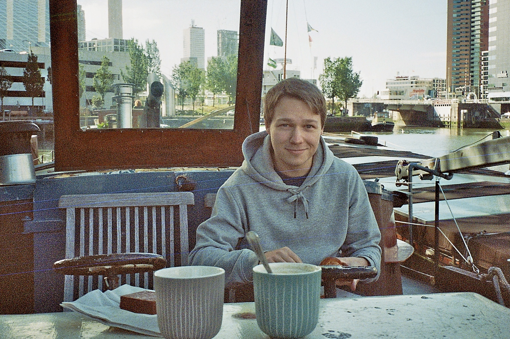

Hey! My name is Stevie and this is my blog. I am a 28-year-old rascal living in Munich, Germany. My passions include software development tools, video game programming, procedural generation, music and philosophy. I hold a M.Sc. in computer science and a B.A. in philosophy, both from LMU Munich. Since graduating, I have worked as a fullstack web developer and attempted to create two video games. Now I am focused on building _Seaside_, a modern IDE for the C programming language.

If you want to contact me, feel free to send an email to [stevie.blog.contact@gmail.com](mailto:stevie.blog.contact@gmail.com).
