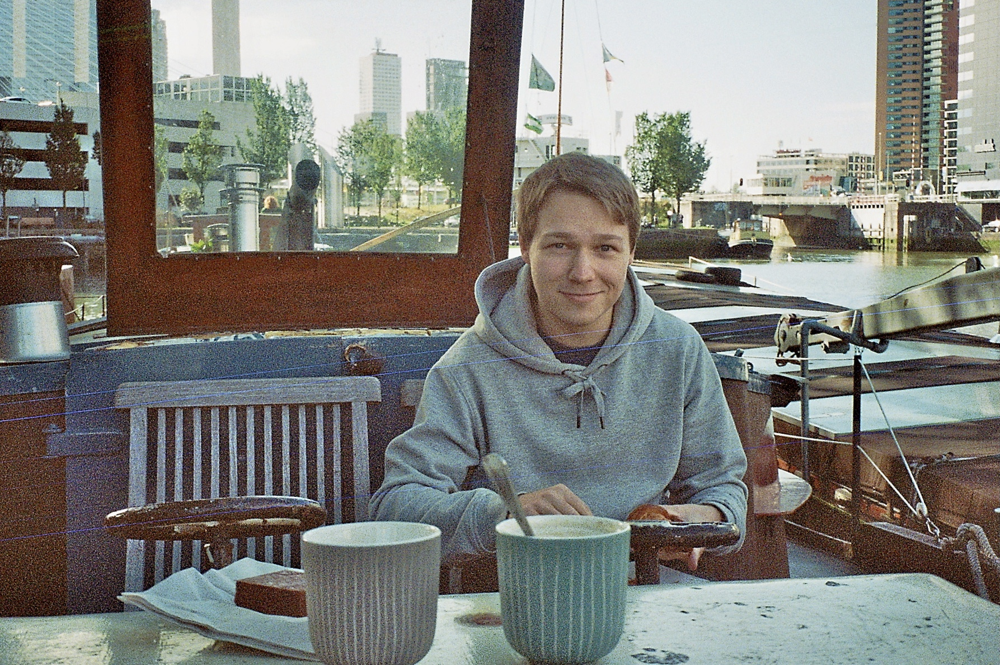

Hey! My name is Stefan R. Seil and this is my blog. I am AGE years old and live in Munich, Germany. My passions include video game programming, procedural generation, music and philosophy. I hold a M.Sc. in computer science and a B.A. in philosophy, both from LMU Munich. Since graduating, I have worked as a fullstack web developer, attempted to create multiple video games, and now work at [twobrains](https://twobrains.com).

If you want to contact me, feel free to send an email to [contact@srseil.com](mailto:contact@srseil.com).

