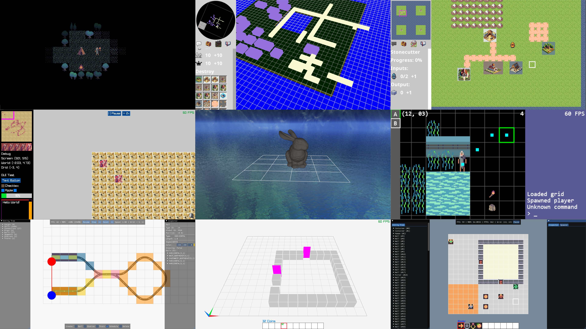
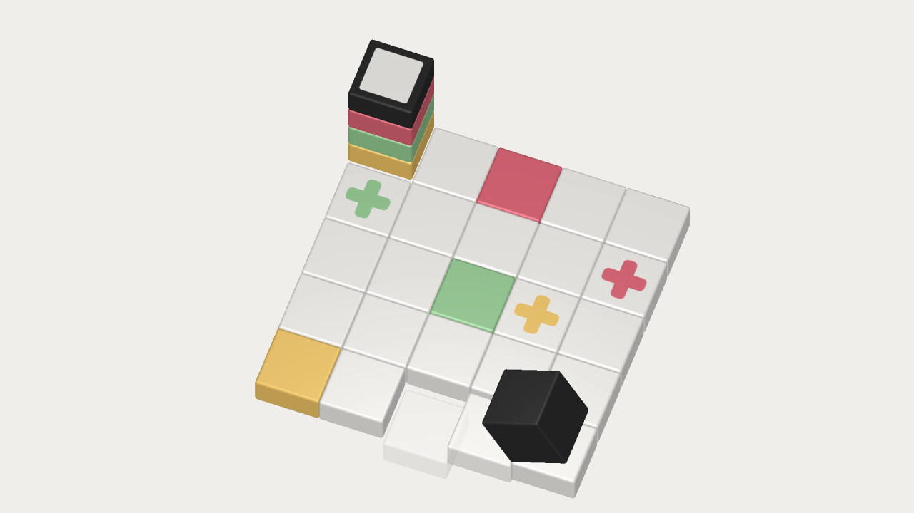

# Video Game Prototypes

Between 2021 and 2025, I developed a number of technical prototypes for various video game ideas I came up with. Most of these didn't reach the stage of actually being playable _as games_, instead they should be seen as experiments in using different languages, frameworks and architectures for video game programming. In 2025, I realized that I have grown out of gaming for the most part, and that I'm not all that drawn to the game design aspect of creating video games. I do however still enjoy the technical aspects of it and hope to be able to engage with them through other means. Among the created prototypes are [a small traditional roguelike](https://github.com/srseil/Nightshade) (this one is actually playable!), [a real-time strategy city builder](https://github.com/srseil/Conquest), and [a transport simulation game](https://github.com/srseil/Orbit). All prototypes are available [on Github](https://github.com/srseil).

# Cubicolor

Cubicolor is a minimalist 3D puzzle game which I developed and self-published [on Steam](https://store.steampowered.com/app/454190/Cubicolor/) in 2016. The game was initially written in Java with the libGDX game development framework. Over the course of the following two years I fixed bugs, added requested features, and ended up re-implementing the game in the Godot engine. The code can be found [on Github](https://github.com/srseil/Cubicolor).
